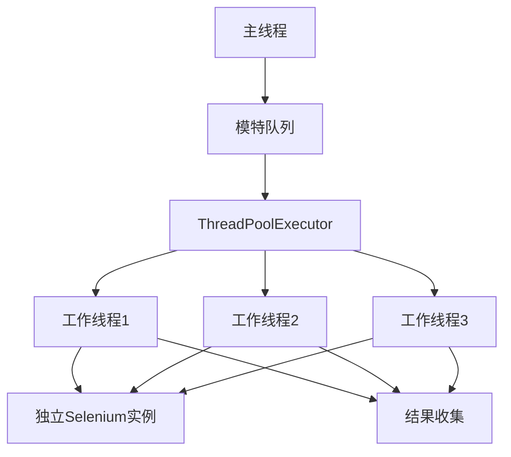

## 需求概述

对现有模特视频查重系统进行三项性能优化：

### P0-2: ChromeDriver 版本检测

- 检测本地 Chrome 浏览器版本
- 自动下载匹配版本的 ChromeDriver
- 避免版本不兼容导致的启动失败

### P1-1: 多线程抓取

- 将单线程顺序处理改为多线程并发处理
- 支持配置并发工作线程数（建议 3-5 个）
- 每个线程独立管理 Selenium 实例
- 预期速度提升 3-5 倍

### P1-2: 智能缓存更新

- 实现增量更新机制，只抓取新增内容
- 记录每页最后抓取时间，避免重复抓取
- 智能判断缓存有效性，减少 90% 重复抓取
- 支持缓存过期策略配置

## 技术栈

- Python 3.x
- Selenium + WebDriver Manager
- concurrent.futures (ThreadPoolExecutor)
- JSON 缓存存储

## 实现方案

### 1. ChromeDriver 版本检测

- 使用 `webdriver_manager` 的 `ChromeDriverManager` 配合版本检测
- 通过注册表或命令行获取本地 Chrome 版本
- 自动下载匹配的 ChromeDriver 版本

### 2. 多线程抓取架构



### 3. 智能缓存设计

- 缓存结构扩展：增加 `last_page_fetched`、`page_timestamps`、`video_metadata`
- 增量抓取：从上次抓取的最后一页继续
- 时间戳对比：只抓取新发布的视频

## 目录结构

```
f:/Pornographic-Video-Content-Similarity-Detection/
├── core/
│   ├── core.py                          # [MODIFY] 添加多线程处理逻辑
│   ├── modules/
│   │   ├── common/
│   │   │   ├── selenium_helper.py       # [MODIFY] 添加 Chrome 版本检测
│   │   │   ├── common.py                # [MODIFY] 增强缓存管理功能
│   │   │   └── chrome_version.py        # [NEW] Chrome 版本检测模块
│   │   ├── pronhub/
│   │   │   └── pronhub.py               # [MODIFY] 支持增量抓取
│   │   └── javdb/
│   │       └── javdb.py                 # [MODIFY] 支持增量抓取
├── config.yaml                          # [MODIFY] 添加多线程和智能缓存配置
└── MULTITHREADING_IMPLEMENTATION.md     # [已存在] 多线程实现参考文档
```

## 关键代码结构

### Chrome 版本检测接口

```python
class ChromeVersionManager:
    @staticmethod
    def get_local_chrome_version() -> Optional[str]
    
    @staticmethod
    def get_matching_chromedriver(chrome_version: str) -> str
    
    @staticmethod
    def setup_driver_with_version_match(config: dict) -> webdriver.Chrome
```

### 多线程处理接口

```python
def process_single_model(
    model_info: Tuple,
    config: dict,
    logger: logging.Logger,
    running_flag: Optional[callable]
) -> Dict

class ModelProcessor:
    def __init__(self, max_workers: int, config: dict)
    def process_all(self, models: List) -> List[Dict]
```

### 智能缓存接口

```python
class SmartCache:
    def load(self, model_name: str) -> Dict
    def save(self, model_name: str, data: Dict)
    def get_last_page(self, model_name: str) -> int
    def should_update_page(self, model_name: str, page_num: int) -> bool
    def update_page_timestamp(self, model_name: str, page_num: int)
```